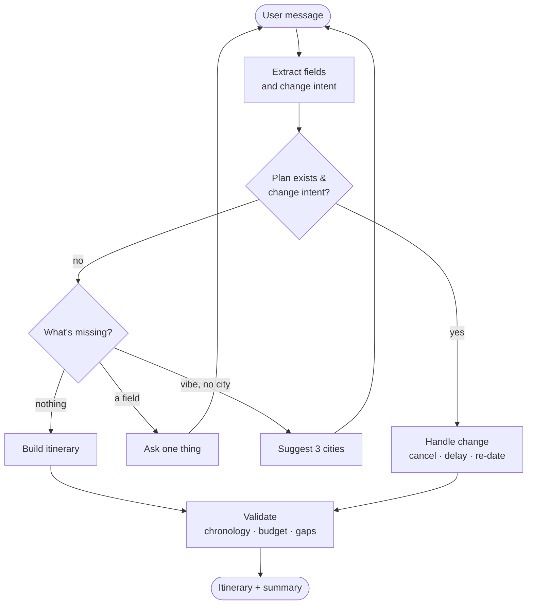
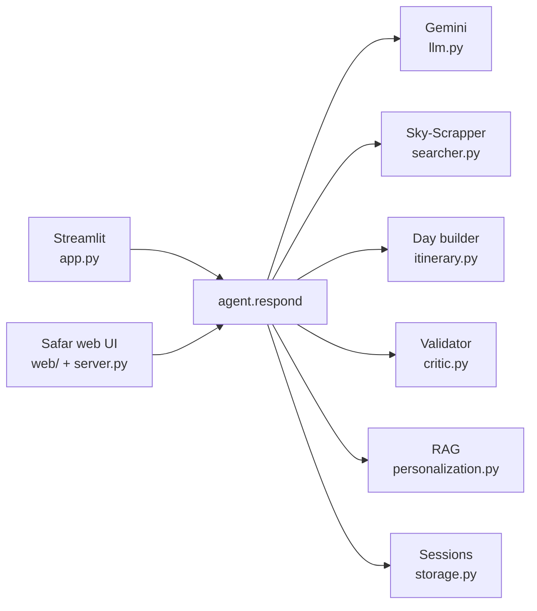

<div align="center">

# ✈️ Safar

### Agentic travel planner for India

<p align="center">
  
</p>

Tell it anything about your trip — even just _"I want to plan a trip."_

Safar asks the right questions, suggests places that fit your vibe,
plans the journey day by day, and re-plans on the fly when a flight slips.

<br>

[](https://python.org)
[](https://aistudio.google.com)
[](https://streamlit.io)
[](https://github.com/facebookresearch/faiss)

</div>

<br>

---

## What it does

A chat-style planner built on a small Python state machine and three free services — no model training, no heavy backend, just clean orchestration.

```
USER   Bangalore to Kerala for 5 days with 3 people, no budget
SAFAR  What kind of trip — adventure, religious, nature, party…?

USER   nature
SAFAR  Picks Munnar (2n) → Alleppey (2n) → Kochi (1n).
       Plans Day 1…5 with activities, meals and inter-city transit.
       Total ₹65,820.

USER   my flight got cancelled
SAFAR  Re-books the next-cheapest flight and re-anchors every check-in.
```

---

## Highlights

| | |
|---|---|
| 🗣️ **One sentence in, a full plan out** | Or guided there one question at a time |
| 🧠 **Understands messy input** | Relative dates, typos, `40k` budgets, state names |
| 🗺️ **State → cities** | _"Kerala"_ becomes the right cities, with nights split sensibly |
| 🎯 **Smart suggestions** | Offers 3 cities for your vibe, re-rolls ones you've seen |
| 📅 **Day-by-day itineraries** | Time-ordered activities, meals, stays and transit |
| 💰 **Realistic costs** | Flights × travellers, hotels per room, rest per person |
| ⚡ **Handles disruptions** | Cancel, delay or re-date — the trip re-anchors instantly |
| 👥 **Travellers like you** | Semantic search over a survey, with persona fallback |
| 🌐 **Works anywhere** | Two UIs, no build step, sample trip runs with no keys |

---

## Quickstart

```bash
git clone https://github.com/swarnika-cmd/TravelAgent.git
cd TravelAgent
pip install -r requirements.txt
```

**Safar web UI** — http://127.0.0.1:8000

```bash
python server.py
```

**Streamlit app** — http://localhost:8501

```bash
streamlit run app.py
```

> **No Gemini key?** Open the web UI and click **Explore a sample trip** to tour
> a complete Bangalore → Kerala itinerary entirely offline.

---

## Configuration

Create a `.env` file in the project root:

```ini
GEMINI_API_KEY=AIzaSy...           # https://aistudio.google.com/apikey
RAPIDAPI_KEY=your_rapidapi_key     # optional — enables live flight/hotel prices
RAPIDAPI_HOST=sky-scrapper.p.rapidapi.com
```

> Each session is capped at 80 LLM calls (configurable in `storage.py`).

---

## The two interfaces

|  | Streamlit | Safar web UI |
|---|---|---|
| Dependencies | `streamlit` | none — Python stdlib only |
| Build step | none | none |
| Layout | chat + sidebar + tabs | journey board + route line + chat |
| Extras | — | quick plan · trip actions · share · print |

### Safar web UI features

The trip becomes a journey on a split-flap departure board — threaded by a route line, with boarding-pass tickets and "travellers like you" matches.

- 🛫 **Departures board** — origin, destination, dates and status flip into place as the brief fills in
- 🧵 **Route line** — each day is a stop, with time-ordered activities, meals, transit and stays
- 🎟️ **Tickets & stays** — the flight as a boarding pass, hotels as reservation slips
- ⚡ **Quick plan** — dropdowns for origin, destination, date, days, travellers, vibe and budget
- 🛠️ **Trip actions** — rebook, delay, re-date or start over; the itinerary re-anchors
- 🔗 **Share & print** — copy a deep link to the trip, or print to PDF

Responsive, keyboard-friendly, and motion-aware.  
Deep links: `?sid=…` opens a saved trip · `?quick=1` opens the planner.

---

## How it works

Every turn flows through a single `respond()` orchestrator.



---

## Architecture

A Python state machine around three free services, reachable from either UI.



| Service | Role | Without a key |
|---|---|---|
| **Google Gemini** | Understanding, suggestions, on-demand content | Model fallback chain, auto-walks on overload |
| **Sky-Scrapper** | Live flight + hotel prices | Realistic mocks |
| **FAISS** | "Travellers like you" semantic search | Hand-written personas |

---

## HTTP API

A tiny stdlib server wrapping the same agent the Streamlit app uses.

| Route | Method | Does |
|---|---|---|
| `/api/state` | `GET` | Current state + runtime flags |
| `/api/chat` | `POST` | Run a turn |
| `/api/reset` | `POST` | Clear the session |
| `/api/sample` | `POST` | Seed the offline sample trip |
| `/api/brief` | `POST` | Apply structured fields (no LLM) |
| `/api/plan` | `POST` | Build the itinerary |
| `/api/action` | `POST` | A disruption — cancel · delay · re-date · new |

> `brief`, `plan` and `action` call the real agent internals, so the dropdowns
> and trip actions plan for real — even with no Gemini key.

---

## Cost calculation

Realistic, not naive.

| Item | Rule |
|---|---|
| Flight | Only when it's the right mode for the distance · charged × travellers |
| Hotels | Per room — 1–3 people = 1 room, 4–6 = 2, … |
| Activities & meals | Per person |
| Transit | Train under ~600 km · flight over ~1200 km · cab/bus between |
| Budget | `cap` best-rated within · `cheapest` lowest · `any` mid-tier · `none` asks |

---

## Personalization (RAG)

Each plan surfaces the top 3 similar travellers. Without a dataset, you get five representative personas. To use real data:

```bash
# Drop the Kaggle Indian Travel Survey at data/raw/travel_survey.csv
python personalization.py build
```

---

## Project structure

```
app.py              Streamlit chat UI
server.py           stdlib web server (no extra deps)
sample_trip.py      Offline sample itinerary
web/                Safar frontend — index.html · styles.css · app.js

agent.py            Orchestrator — one respond()
schemas.py          Pydantic models
llm.py              Gemini calls
searcher.py         Sky-Scrapper (live + mock)
itinerary.py        Day-by-day assembly
critic.py           Conflict detector
personalization.py  FAISS RAG
storage.py          Sessions + rate limit
```

---

## Try it

Start with any of these:

```
Bangalore to Mysore for 3 days with 3 people, cheapest possible
I want a 5-day adventure trip from Delhi, no budget
Couple from Mumbai going to Kerala in August, 7 days, ₹80000
Plan a religious trip from Chennai for 4 days under 25k
```

Once a plan exists, try disrupting it:

```
my flight got cancelled   ·   delay 3 hours   ·   change to 2026-08-15
```

---

<div align="center">
<br>
<sub>Built with a small Python state machine, Google Gemini, and care for the journey.</sub>
</div>
