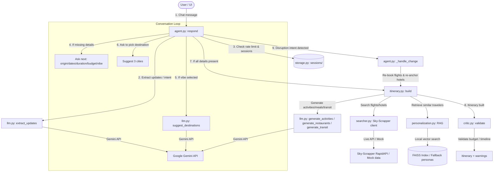

<h1 align="center">Agentic Travel Planner</h1>

<p align="center">
  
</p>

A chat-style travel planner for India. Tell it anything about your trip — even just *"I want to plan a trip"* — and it asks the right follow-up questions, suggests destinations that fit your vibe, plans the day-by-day itinerary, and handles disruptions (delays, cancellations) when you tell it about them.

## What it does

```
USER  Bangalore to Kerala for 5 days with 3 people, no budget
AGENT What kind of trip — adventure, religious, nature, party...?

USER  nature
AGENT Picks Munnar (2n) + Alleppey (2n) + Kochi (1n) for you.
      Plans Day 1...5 with morning/afternoon/evening activities,
      breakfast/lunch/dinner picks, inter-city transit.
      Total ₹47,820 (mid-tier, per-room hotels, train inter-city).

USER  my flight got cancelled
AGENT Re-books the next-cheapest flight and re-anchors all check-ins.
```

## Architecture & Flow Diagram

No model training, no heavy backend. A small Python state machine around three free services:

1. **Google Gemini** — language understanding, destination suggestion, and on-demand generation of activities / restaurants / hotels / transit for any Indian city.
   Fallback chain: `gemini-3.1-flash-lite` → `gemini-2.5-flash-lite` → `gemini-2.5-flash`. Auto-walks the chain on 503 / overload.
2. **Sky-Scrapper (RapidAPI)** — live flight + hotel prices. Mocks gracefully when the key is missing or quota is gone.
3. **Sentence-transformers + FAISS** — local semantic retrieval over the Kaggle Indian Travel Survey for the "people like you" personalization. Falls back to 5 hand-written personas if you haven't built the index.

### Workflow Architecture
The workflow below details how the chat flow, LLM extraction, database matching, and itinerary generation fit together:



### Detailed Working Flow
1. **Intake and Extraction (`agent.py` & `llm.py`)**: Every incoming message is checked for rate-limits and processed via `llm.extract_updates` to identify travel parameters (origin, destinations, dates, duration, budget, vibe) or specific operational commands (cancellations, delays).
2. **Turn-by-Turn Completion**: The agent ensures all parameters are completed sequentially. If a destination state is specified (e.g., "Kerala"), it splits it into a sensible multi-city tour. If only a vibe is selected, it recommends three candidate cities.
3. **Itinerary Assembly (`itinerary.py`)**:
   - **Flights/Hotels**: The agent queries `searcher.py` using Sky-Scrapper to source flights and hotels, using realistic mock data as a graceful fallback.
   - **Local Activities & Diners**: Sourced on-the-fly and cached locally via LLM modules (`generate_activities` and `generate_restaurants`).
   - **Inter-City Ground Transit**: Mode, duration, and price estimations are generated for closer destinations.
4. **Personalization Retriever (`personalization.py`)**: Performs vector-search queries (using Sentence-Transformers & FAISS) over a local index built from the Kaggle Indian Travel Survey to append "similar traveler profiles" to the trip plan.
5. **Conflict Critic (`critic.py`)**: Automatically scans the assembled timeline for over-budget plans, scheduling order errors, or tight transitions.
6. **Change Management**: Detects instructions like "flight cancelled" or "delayed by X hours" to dynamically swap flights and re-anchor check-ins and downstream events.

## Files

```
app.py              Streamlit chat UI (single file)
agent.py            Conversation orchestrator — one respond() function
schemas.py          Pydantic models
llm.py              All Gemini calls (extract, suggest, generate)
searcher.py         Sky-Scrapper client (live + mock)
itinerary.py        Day-by-day plan assembly
critic.py           Conflict detector (chronology, budget, tight gaps)
personalization.py  RAG retriever + index builder
storage.py          Per-session JSON persistence + LLM rate limiter
requirements.txt    Python deps
```

Runtime artifacts in `data/cache/`, `data/sessions/`, `data/raw/` are gitignored.

## Setup

```bash
pip install -r requirements.txt
```

Create `.env`:

```
GEMINI_API_KEY=AIzaSy...                           # https://aistudio.google.com/apikey
RAPIDAPI_KEY=your_rapidapi_key                     # https://rapidapi.com  (optional)
RAPIDAPI_HOST=sky-scrapper.p.rapidapi.com
```

Optional — override the Gemini model chain:

```
GEMINI_MODEL=gemini-3.1-flash-lite,gemini-2.5-flash-lite,gemini-2.5-flash
```

Without a RapidAPI key, flights/hotels come from mocks (the LLM still generates city-realistic hotel options). Everything else still works.

## Run

```bash
streamlit run app.py
```

Opens at http://localhost:8501.

Try these:

- *"Bangalore to Mysore for 3 days with 3 people, cheapest possible"*
- *"I want a 5-day adventure trip from Delhi, no budget"*
- *"Couple from Mumbai going to Kerala in August, 7 days, ₹80000"*
- *"Plan a religious trip from Chennai for 4 days under 25k"*

## Web UI — "Safar"

A second, design-led frontend lives in `web/`, served by a tiny stdlib HTTP
server. **No extra dependencies, no build step** — it talks to the same
`agent.respond()` the Streamlit app uses.

```bash
python server.py            # http://127.0.0.1:8000
python server.py --port 9000
```

The trip is presented as a journey on a **split-flap departure board** with a
day-by-day route line, boarding-pass / reservation tickets, and the
"travellers like you" matches. The conversation drives everything from a side
rail.

No Gemini key yet? Click **Explore a sample trip** (or `POST /api/sample`) to
load a complete Bangalore → Kerala itinerary and tour the whole interface
offline. Add `GEMINI_API_KEY` to chat live.

### Quick plan, trip actions & more

Beyond the chat, a few structured controls drive the **real** planner directly
(no LLM needed for the mechanics — they call `agent._apply_updates`,
`_build_itinerary` and `_handle_change`):

- **Quick plan** — dropdowns for origin, destination, date, days, travellers,
  vibe and budget. Pick a destination and it builds the itinerary on the spot;
  leave it on *"Let AI suggest"* to hand off to the chat (needs a key).
- **Trip actions** — once a plan exists: rebook a cancelled flight, delay it by
  2/3/6h, change the travel date, or start over. Each re-anchors the itinerary.
- **Share** — copies a `?sid=` link to the exact trip. **Print** — a print
  stylesheet lays the itinerary out cleanly for paper or PDF.
- `?quick=1` opens the quick-plan panel on load; `?sid=…` opens a shared trip.

| Route | Does |
|---|---|
| `GET /` | the app (`web/index.html`) |
| `GET /api/state?sid=` | current conversation state + runtime flags |
| `POST /api/chat` | `{sid, message}` → agent reply + new state |
| `POST /api/reset` | clear the session |
| `POST /api/sample` | seed a ready-made sample trip (needs `sample_trip.py`) |
| `POST /api/brief` | `{sid, updates}` → apply structured brief fields (no LLM) |
| `POST /api/plan` | build the itinerary from the current brief |
| `POST /api/action` | a disruption: `cancel_flight` / `delay_flight` / `change_dates` / `new_trip` |

## How the chat flow works

1. Agent asks for whatever's missing — **one thing at a time** (origin / dates / duration / budget / vibe).
2. If you give a state ("Kerala", "Rajasthan"), it picks **multiple cities** in that state matched to the vibe and distributes nights sensibly.
3. If you only give a vibe (no destination), it **suggests 3 specific cities**; "I've been to X" or "show me more" excludes them.
4. Once every required field is filled, it plans and shows the full itinerary.
5. After the plan exists, type something like *"my flight got cancelled"* / *"delay 3 hours"* / *"change to 2026-08-15"* and the agent re-plans the affected leg.

## How the cost is calculated

Realistic, not naive:

- **Flight** — only if the LLM says flight is the right mode for the route distance. Otherwise ground transit (train/bus/cab) is inserted on Day 1. Flight cost × travellers.
- **Hotels** — per **room**, not per person. 1-3 people = 1 room, 4-6 = 2 rooms, etc.
- **Activities + meals** — per person.
- **Inter-city transit** — train under ~600 km, flight over ~1200 km, cab/bus in between.
- **Budget mode** controls hotel pick: `cap` = best-rated within budget; `cheapest` = cheapest available; `any` = mid-tier (not max luxury); `none` = agent asks first.

## Personalization (RAG)

Each plan includes the top 3 "similar travelers" retrieved from a survey corpus. Without the dataset, you get 5 representative personas. To use real data:

1. Drop `travel_survey.csv` from the Kaggle Indian Travel Survey at `data/raw/travel_survey.csv`.
2. Build the index once:
   ```bash
   python personalization.py build
   ```
3. Run as normal — embeddings live in `data/cache/rag/`.

## Per-session rate limit

Each chat is capped at **80 LLM calls** (configurable in `storage.py`). The sidebar shows usage. "Clear chat & start over" resets the counter and the saved JSON.

## Assignment coverage

| Requirement | Where |
|---|---|
| Travel Brief Intake | `llm.extract_updates` runs every turn |
| Agentic Search | `searcher` (live + mock) + `llm.generate_*` for unknown cities |
| Itinerary Assembly | `itinerary.build` — day-by-day, multi-city, transit-aware |
| Conflict Resolution | `critic.validate` — chronology, budget, tight gaps |
| Change Management | `agent._handle_change` — cancel / delay / dates / new trip |
| Traveller Dashboard | `app.py` (Streamlit) **and** `server.py` + `web/` (Safar web UI) |## Deployment

### 1. Streamlit Dashboard App (`app.py`)
Streamlit apps are highly portable and can be deployed easily on the cloud:
* **Streamlit Community Cloud (Free & Recommended)**:
  1. Push the code to a GitHub repository.
  2. Log into [share.streamlit.io](https://share.streamlit.io/).
  3. Click **New App**, select your repo, branch (`main`), and set the main file path to `app.py`.
  4. Under **Settings -> Secrets**, paste your `.env` variables (e.g., `GEMINI_API_KEY`, and optional `RAPIDAPI_KEY` / `RAPIDAPI_HOST`).
* **Hugging Face Spaces or Render**:
  * You can create a Docker container running streamlit, exposing port `8501`, and run:
    ```bash
    streamlit run app.py --server.port 8501 --server.address 0.0.0.0
    ```

### 2. Custom "Safar" Web UI (`server.py` + `web/`)
Because Safar uses a lightweight zero-dependency stdlib server, it is extremely easy to host on platform-as-a-service providers like **Render**, **Railway**, or **Heroku**:
* **Render Web Service (Recommended)**:
  1. Create a new **Web Service** linked to your GitHub repository.
  2. Set the Environment to **Python**.
  3. **Build Command**: `pip install -r requirements.txt`
  4. **Start Command**: `python server.py --host 0.0.0.0 --port $PORT` (Render dynamically assigns a port via the `$PORT` environment variable).
  5. Add your `GEMINI_API_KEY` to the service's Environment Variables.
* **VPS Deployment (Ubuntu / Nginx)**:
  1. Set up a systemd service to run:
     ```bash
     python server.py --host 127.0.0.1 --port 8000
     ```
  2. Reverse-proxy port `8000` using Nginx to handle SSL and domain routing.

## Project layout map

```
.
├── app.py              # Streamlit entry
├── server.py           # stdlib web server for the Safar UI (no extra deps)
├── sample_trip.py      # offline sample itinerary for the web UI
├── web/                # Safar frontend — index.html / styles.css / app.js
├── agent.py            # orchestrator
├── schemas.py          # types
├── llm.py              # Gemini wrapper
├── searcher.py         # Sky-Scrapper
├── itinerary.py        # day builder
├── critic.py           # validator
├── personalization.py  # RAG
├── storage.py          # session + rate limit
├── requirements.txt
├── README.md
├── .env                # local secrets (gitignored)
├── .gitignore
└── data/
    ├── cache/          # LLM + API caches (gitignored)
    ├── sessions/       # per-user chat JSONs (gitignored)
    └── raw/            # optional Kaggle CSVs (gitignored)
```
