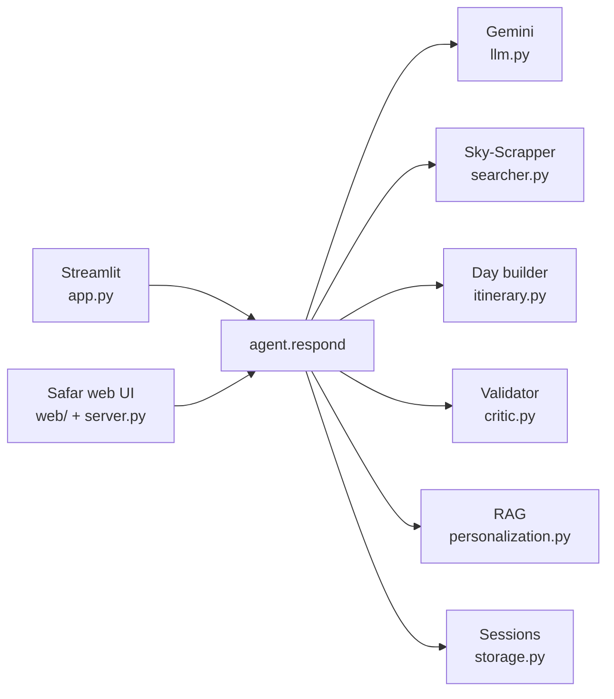

<div align="center">

# ✈️ Safar

### Agentic travel planner for India

<p align="center">
  
</p>

Tell it anything about your trip — even just _"I want to plan a trip."_

Safar asks the right questions, suggests places that fit your vibe,
plans the journey day by day, and re-plans on the fly when a flight slips.

<br>

`Python` · `Google Gemini` · `Streamlit + zero-dependency web UI` · `FAISS RAG`

</div>

<br>

---

<br>

## What it does

A chat-style planner built on a small Python state machine and three free services.

No model training. No heavy backend. Just clean orchestration.

<br>

```
USER   Bangalore to Kerala for 5 days with 3 people, no budget
SAFAR  What kind of trip — adventure, religious, nature, party…?

USER   nature
SAFAR  Picks Munnar (2n) → Alleppey (2n) → Kochi (1n).
       Plans Day 1…5 with activities, meals and inter-city transit.
       Total ₹65,820.

USER   my flight got cancelled
SAFAR  Re-books the next-cheapest flight and re-anchors every check-in.
```

<br>

---

<br>

## Highlights

- **One sentence in, a full plan out** — or guided there one question at a time.

- **Understands messy input** — relative dates, typos, `40k` budgets, state names.

- **State → cities** — _"Kerala"_ becomes the right cities, with nights split sensibly.

- **Smart suggestions** — offers 3 cities for your vibe, and re-rolls the ones you've seen.

- **Day-by-day itineraries** — time-ordered activities, meals, stays and transit.

- **Realistic costs** — flights × travellers, hotels per room, the rest per person.

- **Handles disruptions** — cancel, delay or re-date, and the trip re-anchors instantly.

- **Travellers like you** — semantic search over a survey, with persona fallback.

- **Works anywhere** — two UIs, no build step, and a sample trip that runs with no keys.

<br>

---

<br>

## How it works

Every turn flows through a single `respond()` orchestrator.

<br>


<br>

---

<br>

## Architecture

A Python state machine around three free services, reachable from either UI.

<br>



<br>

| Service | Role | Without a key |
|---|---|---|
| **Google Gemini** | understanding, suggestions, on-demand content | model fallback chain, auto-walks on overload |
| **Sky-Scrapper** | live flight + hotel prices | realistic mocks |
| **FAISS** | "travellers like you" | hand-written personas |

<br>

---

<br>

## Quickstart

```bash
pip install -r requirements.txt
```

<br>

**Safar web UI** — http://127.0.0.1:8000

```bash
python server.py
```

**Streamlit app** — http://localhost:8501

```bash
streamlit run app.py
```

<br>

> No Gemini key? Open the web UI and click **Explore a sample trip** to tour
> a complete Bangalore → Kerala itinerary entirely offline.

<br>

---

<br>

## The two interfaces

|  | Streamlit | Safar web UI |
|---|---|---|
| Dependencies | `streamlit` | none — Python stdlib |
| Build step | none | none |
| Layout | chat + sidebar + tabs | journey board + route line + chat |
| Extras | — | quick plan · trip actions · share · print |

<br>

---

<br>

## Safar web UI features

The trip becomes a journey on a split-flap departure board — threaded by a
route line, with boarding-pass tickets and "travellers like you" matches.

<br>

- **🛫 Departures board** — origin, destination, dates and status flip into place as the brief fills in.

- **🧵 Route line** — each day is a stop, with time-ordered activities, meals, transit and stays.

- **🎟️ Tickets & stays** — the flight as a boarding pass, hotels as reservation slips.

- **⚡ Quick plan** — dropdowns for origin, destination, date, days, travellers, vibe and budget.

- **🛠️ Trip actions** — rebook, delay, re-date or start over; the itinerary re-anchors.

- **🔗 Share & print** — copy a deep link to the trip, or print to PDF.

<br>

Responsive, keyboard-friendly, and motion-aware.
Deep links: `?sid=…` opens a saved trip · `?quick=1` opens the planner.

<br>

---

<br>

## HTTP API

A tiny stdlib server wrapping the same agent the Streamlit app uses.

<br>

| Route | Does |
|---|---|
| `GET /api/state` | current state + runtime flags |
| `POST /api/chat` | run a turn |
| `POST /api/reset` | clear the session |
| `POST /api/sample` | seed the offline sample trip |
| `POST /api/brief` | apply structured fields (no LLM) |
| `POST /api/plan` | build the itinerary |
| `POST /api/action` | a disruption — cancel · delay · re-date · new |

<br>

> `brief`, `plan` and `action` call the real agent internals, so the dropdowns
> and trip actions plan for real — even with no Gemini key.

<br>

---

<br>

## How costs are calculated

Realistic, not naive.

<br>

| Item | Rule |
|---|---|
| Flight | only when it's the right mode for the distance · charged × travellers |
| Hotels | per room — 1–3 people = 1 room, 4–6 = 2, … |
| Activities & meals | per person |
| Transit | train under ~600 km · flight over ~1200 km · cab/bus between |
| Budget | `cap` best-rated within · `cheapest` lowest · `any` mid-tier · `none` asks |

<br>

---

<br>

## Personalization (RAG)

Each plan surfaces the top 3 similar travellers. Without a dataset, you get
five representative personas. To use real data:

```bash
# drop the Kaggle Indian Travel Survey at data/raw/travel_survey.csv
python personalization.py build
```

<br>

---

<br>

## Configuration

Create a `.env`:

```ini
GEMINI_API_KEY=AIzaSy...          # https://aistudio.google.com/apikey
RAPIDAPI_KEY=your_rapidapi_key    # optional
RAPIDAPI_HOST=sky-scrapper.p.rapidapi.com
```

Each session is capped at 80 LLM calls (set in `storage.py`).

<br>

---

<br>

## Project structure

```
app.py              Streamlit chat UI
server.py           stdlib web server (no extra deps)
sample_trip.py      offline sample itinerary
web/                Safar frontend — index.html · styles.css · app.js

agent.py            orchestrator — one respond()
schemas.py          Pydantic models
llm.py              Gemini calls
searcher.py         Sky-Scrapper (live + mock)
itinerary.py        day-by-day assembly
critic.py           conflict detector
personalization.py  FAISS RAG
storage.py          sessions + rate limit
```

<br>

---

<br>

## Try it

```
Bangalore to Mysore for 3 days with 3 people, cheapest possible
I want a 5-day adventure trip from Delhi, no budget
Couple from Mumbai going to Kerala in August, 7 days, ₹80000
Plan a religious trip from Chennai for 4 days under 25k
```

Once a plan exists:

```
my flight got cancelled   ·   delay 3 hours   ·   change to 2026-08-15
```

<br>

---

<div align="center">
<br>
<sub>Built with a small Python state machine, Google Gemini, and care for the journey.</sub>
</div>
